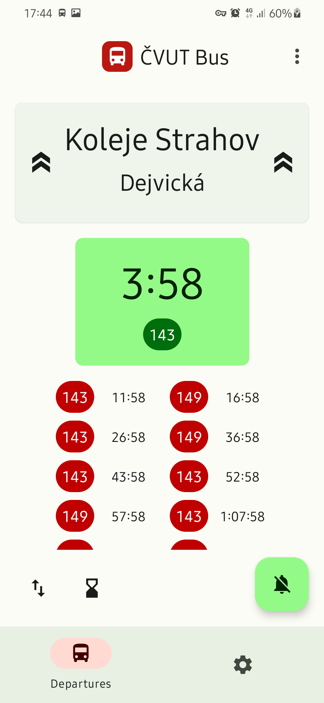
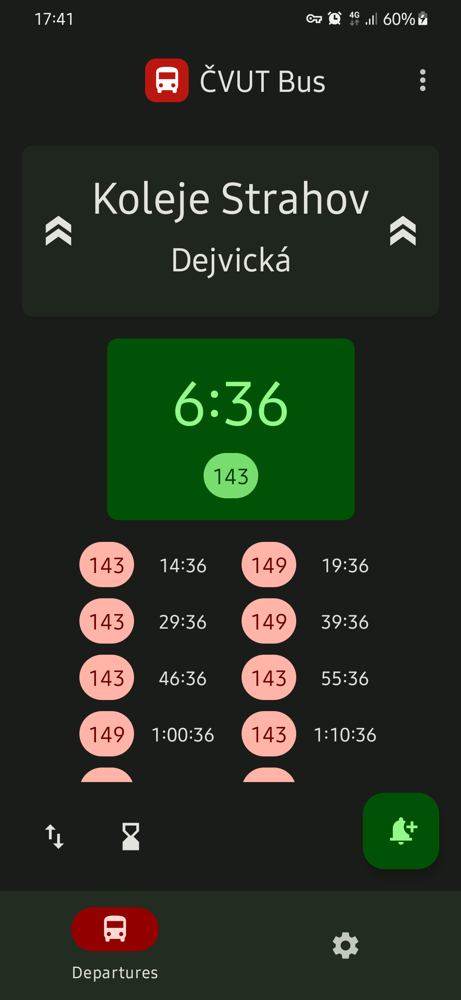
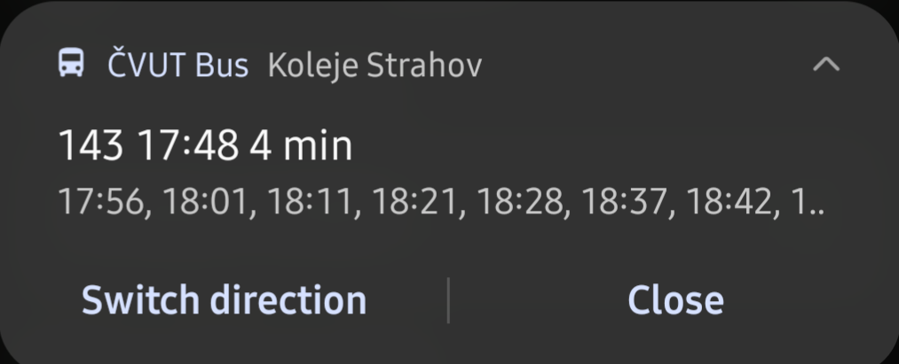

# ČVUT Bus

This Android app shows bus connections from Koleje Strahov station to Dejvická station and the other way in the city of Prague. These are important for many students from the Czech Technical University in Prague.

The core is written using Kotlin Multiplatform. If you want you can port this codebase to another platform. Modified connection database is fetched from this repo from the `cloud_data` branch, where data will be (hopefully regularly) updated from the original source [PID - Prague Public transport](https://pid.cz/o-systemu/opendata/). The database here contains only the data required by the app so it can be much smaller.

## Features

- Departure times from Koleje Strahov and Dejvická station
- Notification with the following times (+ tile)
- The notification can be automatically shown in the morning
- Background data updating
- Large screen and landscape support

## Technologies used

- Jetpack libraries (Compose, Work, Data Store, ...)
- Material You
- Kotlin Multiplatform
- Ktor
- Hilt

## Screenshots

         

   

## License

Licensed under `GNU GPL v3.0` [license](LICENSE).

Developed by Petr Laštovička, Lasta Apps 2022
